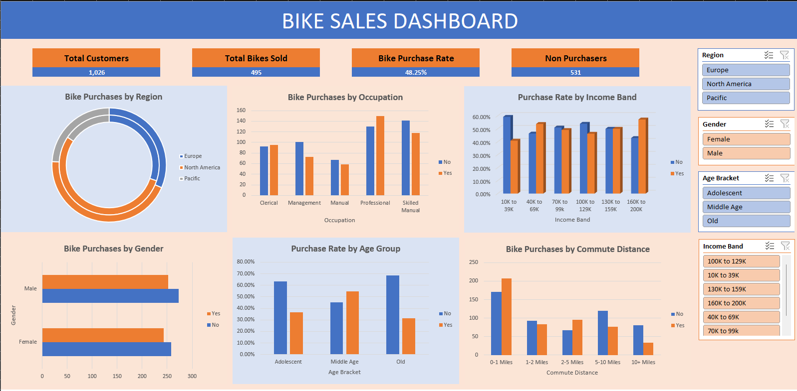

# Bike Sales Dashboard – Excel

## 📊 Project Overview

This project is an interactive Bike Sales Dashboard created using Microsoft Excel.

The dashboard analyzes customer demographics and bike purchase behavior using PivotTables, PivotCharts, KPIs, and interactive slicers.

## 🎯 Project Objectives

- Analyze bike purchase patterns
- Understand customer demographics
- Compare bike purchases across regions
- Analyze purchases by occupation
- Examine purchase rates across income bands
- Compare purchasing behavior by age group and gender
- Analyze purchases based on commute distance

## 🛠️ Tools & Skills Used

- Microsoft Excel
- PivotTables
- PivotCharts
- Slicers
- KPI Cards
- Excel formulas
- Data analysis
- Dashboard design
- Data visualization

## 📌 Key KPIs

- Total Customers
- Total Bikes Sold
- Bike Purchase Rate
- Non Purchasers

## 📈 Dashboard Analysis

The dashboard includes:

- Bike Purchases by Region
- Bike Purchases by Occupation
- Purchase Rate by Income Band
- Bike Purchases by Gender
- Purchase Rate by Age Group
- Bike Purchases by Commute Distance

## 🎛️ Interactive Filters

The dashboard includes slicers for:

- Region
- Gender
- Age Bracket
- Income Band

These filters allow users to interactively explore different customer segments.

## 📷 Dashboard Preview

## 📁 Project Files

- `Bike Sales - Excel Project Dataset.xlsx` – Interactive Excel dashboard and analysis

## 👤 Project

Created as part of my Data Analyst learning and portfolio development journey.
